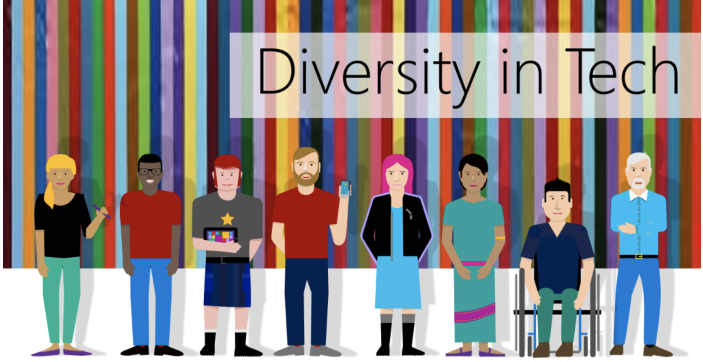

  

# Technology and Equity

## Course Description

This course will investigate the relevance of gender, race, ability and sexuality to understanding equity in technology and the development of new technologies. We will consider a range of questions including: What are some barriers in equity in Computer Science education? How does an organization promote or impede inequality? In addition, this course will utilize methodologies which promote engagement with local communities to enhance civic knowledge and improve student civic skills.

### Core Curriculum Requirement

Technology and Equity satisfies one of Science and Letters CORE categories required for a bachelor’s degree. A final grade of “PASS” is required.

## Course Specifics

**Zoom link**: [make.sc/justine-zoom](make.sc/justine-zoom)

**Slack Channel**: #hcs3131summer21
This platform will be used for Q&As during check-in activities and burning questions your classmates can help clarify, e.g., “Where are the teaching slides?” or “What time is class again?”

**My Personal Slack**: @justinemeyr

If you have questions your classmates and TA (@Tyler Holland) have no answers to, e.g., “Am I on track to pass the course?” and/or emergency requests, e.g., “I have to leave class because of a fire.” DM me on slack.

You can expect a reply from me within 24-hours; Likewise, I expect a response from you within 24-hours if I messaged you about something important personally.

**My Email**:justine@makeschool.com

**Course Delivery**: online  | bichronous | 9 weeks

**Course Credits**: 4 units

## Learning Outcomes

By the end of the course, you will be able to ...

1. Demonstrate an elevated understanding of equity in education and technology.
1. Enhance a critical understanding of intersectionality, including an awareness of gender and its complex intersections in relation to technology and computer science.
1. Cultivate a language framework for thoughtfully articulating critical vocabulary and behaviours in relation to the field of gender, ability, nationality, race, sexuality and women’s studies.
1. Develop reading and writing skills through effective synthesis of written material. Practice conveying course concepts in a concise and clear manner both verbally and in writing.

## Schedule

---

**Course Dates:** Wednesday/Friday, June 2 – July 30, 2021 (9 weeks)

**Class Times:** Wednesday/Friday at 12:45pm–2:15pm (+ asynchronous activities)

| Class |          Date          |                 Synchronous                  |  Asynchronous          |         Homework        |
|:-----:|:----------------------:|:---------------------------------------:|:----------------------:|:------------------------:|
|  1 |  Wed, June 2               | [Introduction to Class](https://docs.google.com/presentation/d/1-2-bpReVOLFU6d8gu1pFI1Hg9GR1aDxc/edit?usp=sharing&ouid=103840187175806137741&rtpof=true&sd=true) |  Syllabus Test |  [Homework 1](https://docs.google.com/document/d/1XzOBQcWRHaD_4bZttGc3s6u4KCeuqrfyiESctj47QeM/edit?usp=sharing)  |
|  2 |  Fri, June 4              |[Guest Speaker: Andrew Rothman](https://docs.google.com/presentation/d/1dXDNMRM52d64eaZvOJ-8D4wc1rdrLtXM/edit?usp=sharing&ouid=103840187175806137741&rtpof=true&sd=true)  | [Podcast/Twitch Topics](https://docs.google.com/document/d/1a7ThWiLSwucSN_HbfXv8J0Zq27ia61Gg/edit?usp=sharing&ouid=103840187175806137741&rtpof=true&sd=true) | [Homework 2](https://docs.google.com/document/d/138qDiOokoP_-xPCrz5bKjPll2lQ9x4z9MtskAorLLW8/edit?usp=sharing)  |
|  3 |  Wed, June 9               | Identity| Module 1   |  [Podcast/Twitch Pitch](https://docs.google.com/document/d/1j4nZTsLW8b42RAJ90c0vhTUv1ZXL6fGZxKwFryQ3T-4/edit?usp=sharing)  |
|  4 |  Fri, June 11               | Workshop: Intercultural Communication  | Module 2 | [Homework 3](https://docs.google.com/document/d/10FILPb7r7pT8WnEvT9uxJWHY41EzdC8W6SyuAMp8Zs8/edit?usp=sharing)|
|  5 |  Wed, June 16               |[Guest Speaker: Joanna Hoffman](https://docs.google.com/presentation/d/1PoO9VYpa19dQdKOhGhlHdZVO4efJ7PIq/edit?usp=sharing&ouid=103840187175806137741&rtpof=true&sd=true) | Module 3 | [RD Audio Recording](https://docs.google.com/document/d/10zxctRgPuLvgbK-8he5GAc0zBZ2p9RYW/edit?usp=sharing&ouid=103840187175806137741&rtpof=true&sd=true) |
|  6 |  Fri, June 18               |Podcast/Twitch Pitch Presentation| Module 4 | [Homework 4](https://docs.google.com/document/d/1EJDuOivhYp16_jHS-wsmuEqmm2eqNdXG/edit?usp=sharing&ouid=103840187175806137741&rtpof=true&sd=true)
|  7 |  Wed, June 23               |[Guest Speaker: Justin Samuels](https://docs.google.com/presentation/d/1ZuXPhZgo0d6pWcUkI9cYaaIowTx2O7-O/edit?usp=sharing&ouid=103840187175806137741&rtpof=true&sd=true)  | Module 5 | [Mentee Presentation](https://docs.google.com/document/d/1o33GFDDgpuFUWCB0rUTf2mq3mp8My-wO55AjbJvNCGo/edit?usp=sharing)   |
|  8 |  Fri, June 25               | Welcome Mentorship Meeting  | Module 6 Reflection| [Cover Art](https://docs.google.com/document/d/1ayVEZLVFNaVMrrROwgQ1YljJziRrKsU8/edit?usp=sharing&ouid=103840187175806137741&rtpof=true&sd=true) |
|  9 |  Wed, June 30               | [Guest Speaker: Ayodele Odubela, AI Justice](https://docs.google.com/presentation/d/1cFOQWE8v8XloySH2dLf_6UQ0I9stTbeh/edit?usp=sharing&ouid=103840187175806137741&rtpof=true&sd=true)  | Module 7   |  [Podcast/Twitch Script](https://docs.google.com/document/d/1QTyhClSws9X2dwkWFz71KQK2vgS9myec/edit?usp=sharing&ouid=103840187175806137741&rtpof=true&sd=true) |
|  10 |  Fri, July 2               | Mentorship Meeting | Module 8 Reflection | [Homework 5](https://docs.google.com/document/d/1LXdt9-v7lOJgqUXQi0Z3TuYg9YlLoWiFRmdygPREGjY/edit?usp=sharing) |
|  11 |  Wed, July 7               | [Guest Speaker: Valdine Bonheur, Microaggressions Workshop](https://docs.google.com/presentation/d/1fzIUL0Qjwkp7AiACSQf8c6i1AOgTJU0I/edit?usp=sharing&ouid=103840187175806137741&rtpof=true&sd=true)  | Module 9 | [Self Reflection](https://docs.google.com/document/d/1TGYgP09omcYOpZlagGwn1O_17TfpwAZ_odobB_fbEzs/edit?usp=sharing) |
|  12 |  Fri, July 9              | Mentorship Meeting | Module 10 Reflection| Work On Podcast/Twitch Script |
|  13 |  Wed, July 14               | [Guest speaker: Drew Moxonm, DEI Being an Ally](https://docs.google.com/presentation/d/1lj5hUwoBNtYXee2Z3cfLEXwRsISMNorv/edit?usp=sharing&ouid=103840187175806137741&rtpof=true&sd=true) | Module 11 | [Peer Review](https://docs.google.com/document/d/1c_E0eZZkD8ZhKd1K0oT-mbF32-z67RjW/edit?usp=sharing&ouid=103840187175806137741&rtpof=true&sd=true)  |
|  14 |  Fri, July 16               | Mentorship Meeting | Module 12 Reflection | [Homework 6](https://docs.google.com/document/d/1Sk8b5aJ1HmK2Y2tCg4bjQJ6hP32nks8HJQqV7Blam8o/edit?usp=sharing)  |
|  15  |  Wed, July 21              | Workshop on Gender Neutral Pronouns| Module 13 | [Final Podcast/Twitch](https://docs.google.com/document/d/1kDI98vcNpYf1kq-e79qVUmPdyDxOk8mD/edit?usp=sharing&ouid=103840187175806137741&rtpof=true&sd=true)|
|  16 |   Fri, July 23               | Mentorship Meeting | Module 14 Reflection | [Homework 7](https://docs.google.com/document/d/1Sk8b5aJ1HmK2Y2tCg4bjQJ6hP32nks8HJQqV7Blam8o/edit?usp=sharing) |
|  17 |   Wed, July 28               |[Engineering Peace](https://docs.google.com/presentation/d/1XJHf90bHdTDV_pytKikZPjOOAKvjnEEk/edit?usp=sharing&ouid=103840187175806137741&rtpof=true&sd=true)|  Module 15  |  [Podcast/Twitch Presentation](https://docs.google.com/document/d/1kDI98vcNpYf1kq-e79qVUmPdyDxOk8mD/edit?usp=sharing&ouid=103840187175806137741&rtpof=true&sd=true) |
|  18 |   Fri, July 30              | Final Class Presentations| Mentorship Goodbyes |

## Assignment Schedule
All assignments are due **before class** on the due date stated

| Assignment            |          Date Assigned        |                 Due Date                           |
|:------------------------------:|:----------------------:|:----------------------------------------:|
|  [Podcast/Twitch Pitch](https://docs.google.com/document/d/1j4nZTsLW8b42RAJ90c0vhTUv1ZXL6fGZxKwFryQ3T-4/edit?usp=sharing)              | June 9th |    June 18th |
|  [RD Audio Recording](https://docs.google.com/document/d/10zxctRgPuLvgbK-8he5GAc0zBZ2p9RYW/edit?usp=sharing&ouid=103840187175806137741&rtpof=true&sd=true)              | June 16th  | June 23rd   |
|  [Cover Art](https://docs.google.com/document/d/1ayVEZLVFNaVMrrROwgQ1YljJziRrKsU8/edit?usp=sharing&ouid=103840187175806137741&rtpof=true&sd=true)              | June 25th   | July 2nd   |
|  [Podcast/Twitch Script](https://docs.google.com/document/d/1QTyhClSws9X2dwkWFz71KQK2vgS9myec/edit?usp=sharing&ouid=103840187175806137741&rtpof=true&sd=true)              | June 30th | July 14th  |
|  [Self Reflection](https://docs.google.com/document/d/1TGYgP09omcYOpZlagGwn1O_17TfpwAZ_odobB_fbEzs/edit?usp=sharing)              | July 7th  | July 9th  |
| [Peer Review](https://docs.google.com/document/d/1c_E0eZZkD8ZhKd1K0oT-mbF32-z67RjW/edit?usp=sharing&ouid=103840187175806137741&rtpof=true&sd=true)   | July 14   | July 16|
|  [Final Podcast/Twitch](https://docs.google.com/document/d/1kDI98vcNpYf1kq-e79qVUmPdyDxOk8mD/edit?usp=sharing&ouid=103840187175806137741&rtpof=true&sd=true)              | July 21st  | July 30th |
| Weekly Homework | *See Homework above*|
| 15 Weekly Modules |  *See Asynchronous Activities above* |

## Class Assignments

We will be using [Gradescope](https://www.gradescope.com/courses/271740), which allows us to provide fast and accurate feedback on your work. *All assigned work will be submitted through Gradescope, and assignment and exam grades will be returned through Gradescope.*

As soon as grades are posted, you will be notified immediately so that you can log in and see your feedback. You may also submit regrade requests if you feel we have made a mistake.

Your Gradescope login is your Make School email, and your password can be changed at [https://gradescope.com/reset_password](https://gradescope.com/reset_password). The same link can be used if you need to set your password for the first time.

## Evaluation

To pass this course you must meet the following requirements:

- Complete all formal assignments
- Actively participate in class and abide by the attendance policy
- Make up all classwork from all absences
- Participate in the Mentorship component of the course
- Complete all assignments with a minimum rubric score of 3 or 4

| Assignments |          Weight         |                 Minimum Rubric Score                          |
|:-----:|:----------------------:|:----------------------------------------------:|
|**Participation**: Attendance, active participation in zoom and in class google docs; online asynchronous assignments, and reflections. Participation points will be allocated on a weekly basis.  |  10%  |  N/A  |
|**Self Reflection Paper**: Students will give feedback and write one reflective paper about personal growth. Students are expected to meet a minimum score of 3-4 on the [Written Communication Rubric](https://docs.google.com/document/d/18isv83H2pV-GfPMwRwoxvuQDHtr9QssK/edit?usp=sharing&ouid=103840187175806137741&rtpof=true&sd=true). |  10%  |  3-4  |
|**Mentorship meetings**: Students must participate in weekly virtual meetings with students in Make School Summer Academy in order to pass the course.  Students must come prepared with all necessary materials needed for the designated meetings. Students must complete weekly asynchronous reflection modules post mentorship meetings  |  20%  |  N/A  |
|**Presentations**: Students will present to mentees and classmates.   Students are expected to meet a minimum score of 3-4 on the [Oral Communication Rubric](https://docs.google.com/document/d/1x4f4GjzmT1StEmEatSXO9KIb5EjsburE/edit?usp=sharing&ouid=103840187175806137741&rtpof=true&sd=true) |  20%  |  3-4  |
|**Final Podcast/Twitch Stream,**: Group Podcast/Twith streams on a topic discussed by guest speakers, class readings, and personal experiences.  Students are expected to meet a minimum score of 3-4 on the [Digital Project Rubric](https://docs.google.com/document/d/1rJHId-BlEjw0wlePl6-OnLXiBqVAeo3chlIfGaGODKg/edit) |  40%  |  3-4  |

***[Code of Conduct, Equity, and Inclusion](https://docs.google.com/document/d/1a1i2jwXqx__URpWvUf8z8E9iwcdJ05QsPnbjs7Z83Us/preview#heading=h.x0jvq6l5kdwl)***

Make School nurtures attitudes and behaviors that promote global awareness, inclusivity, and respect for the dignity of each person regardless of race, ethnicity, gender, sexual orientation, age, socioeconomic status, culture, political conviction, religion, or disability. We are committed to creating an environment in which every individual can work, study, and live without feeling excluded, unsafe, or harassed.

During classrooms discussions, you may encounter opposing and different views with your classmates, and that is totally fine. In fact, I welcome a diverse array of opinions. Part of a healthy discussion is being able to discuss those differences clearly and respectfully. Sometimes, you may think your classmates’ questions are “stupid,” but they deserve the same level of respect from you as you wish from them. You can expect me to be fair, and I will not tolerate any hate speech (e.g. any attacks on another person’s identity, background, life experiences) in class. If the need arises, I will respectfully ask you to leave the discussion/zoom room.

Make School’s desire to foster a professional environment that honors the freedom of expression is equally balanced with pursuit to create an inclusive living and learning environment.

##  Information Resources

Any additional resources you may need (online books, etc.) can be found here. You can also find additional resources through the library linked below:

- [make.sc/library](http://make.sc/library)

## Make School Course Policies

- [Program Learning Outcomes](https://make.sc/program-learning-outcomes) - What you will achieve after finishing Make School, all courses are designed around these outcomes.
- [Grading System](https://make.sc/grading-system) - How grading is done at Make School
- [Code of Conduct, Equity, and Inclusion](https://make.sc/code-of-conduct) - Learn about Diversity and Inclusion at Make School
- [Academic Honesty](https://make.sc/academic-honesty-policy) - Our policies around plagerism, cheating, and other forms of academic misconduct
- [Attendance Policy](https://make.sc/attendance-policy) - What we expect from you in terms of attendance for all classes at Make School
- [Course Credit Policy](https://make.sc/course-credit-policy) - Our policy for how you obtain credit for your courses
- [Disability Services (Academic Accommodations)](https://make.sc/disability-services) - Services and accommodations we provide for students
- [Online Learning Tutorial](https://make.sc/online-learning-tutorial) - How to succeed in online learning at Make School
- [Student Handbook](https://make.sc/student-handbook) - Guidelines, policies, and resources for all Make School students
