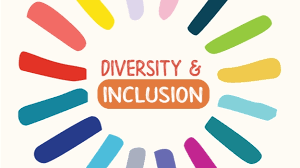

  

# Technology and Equity

## Course Description

This course will investigate the relevance of gender, race and sexuality to understanding equity in technology and the development of new technologies. We will consider a range of questions including: What are some barriers in equity in Computer Science education? And how does an organization promote or impede inequality? In addition, this course will utilize methodologies which promote engagement with local communities to enhance civic knowledge and improve student civic skills.

### Core Curriculum Requirement

Technology and Equity satisfies one of Science and Letters course categories required for a bachelor’s degree. A final grade of “PASS” is required.

## Course Specifics

**Zoom link**: [make.sc/justine-zoom](make.sc/justine-zoom)

**Slack Channel**: #hcs3131sp2021
This platform will be used for Q&As during check-in activities and burning questions your classmates can help clarify, e.g., “Where is the teaching slides?” or “What time is class again?”

**My Personal Slack**: @justinemeyr

If you have questions your classmates and TA (@Tyler HOlland) have no answers to, e.g., “Am I on track to pass the course?” and/or emergency requests, e.g., “I have to leave class because of a fire.” DM me on slack.

You can expect a reply from me within 24-hours; Likewise, I expect a response from you within 24-hours if I messaged you about something important personally.

**My Email**:justine@makeschool.com

**Course Delivery**: online | 15 sessions

**Course Credits**: 4 units

## Learning Outcomes

By the end of the course, you will be able to ...

1. Demonstrate an elevated understanding of equity in education and technology
1. Enhance a critical understanding of intersectionality, including an awareness of gender and its complex intersections in relation to technology and computer science.
1. Cultivate a language framework for thoughtfully articulating critical vocabulary and behaviours in relation to the field of gender, race, sexuality and women’s studies.
1. Develop reading and writing skills through effective synthesis of written material. Practice conveying course concepts in a concise and clear manner both verbally and in writing.

## Schedule

---

**Course Dates:** Friday, January 22 – Friday, May 14, 2021 (17 weeks)

**Class Times:** Friday at 9:30am–12:30pm (15 class sessions)

| Class |          Date          |                 Topics                  |  Assigned Readings          |
|:-----:|:----------------------:|:---------------------------------------:|:----------------------:|
|  1 |  Fri, Jan 22               | [Lesson 1] |  [Reading 1]  |
|  2 |  Fri, Jan 29               | [Lesson 2] |[Reading 2]  |
|  3 |  Fri, Feb 5                | [Lesson 3] |[Reading 3]  |
|  4 |  Fri, Feb 12               | [Lesson 4] |[Reading 4]  |
|  5 |  Fri, Feb 19               | [Lesson 5] |[Reading 5]  |
|  6 |  Fri, Feb 26               | [Lesson 6] |[Reading 6]  |
|  7 |  Fri, Mar 5                | [Lesson 7] |[Reading 7]  |
| -  |  Fri, Mar 12               | **No Class - Spring Break** |
| 8  |  Fri, Mar 19               | ***Individual Meetings, No Class*** |
| 9 |   Fri, Mar 26               | [Lesson 8] |[Reading 8]  |
| -  |  Fri, Apr 2                | **No Class - Good Friday**  |
| 10 |  Fri, Apr 9                | [Lesson 9] |[Reading 9]  |
| 11 |  Fri, Apr 16               | [Lesson 10] |[Reading 10]  |
| 12 |  Fri, Apr 23               | [Lesson 11] |[Reading 11]  |
| 13 |  Fri, Apr 30               | [Lesson 12] |[Reading 12]  |
| 14 |  Fri, May 7                | [Lesson 13] |[Reading 13]  |
| 15 |  Fri, May 14                | Podcasts/Presentations  |

[Lesson 1]: Lessons/Lesson1.md
[Lesson 2]: Lessons/Lesson2.md
[Lesson 3]: Lessons/Lesson3.md
[Lesson 4]: Lessons/Lesson4.md
[Lesson 5]: Lessons/Lesson5.md
[Lesson 6]: Lessons/Lesson6.md
[Lesson 7]: Lessons/Lesson7.md
[Lesson 8]: Lessons/Lesson8.md
[Lesson 9]: Lessons/Lesson9.md
[Lesson 10]: Lessons/Lesson10.md
[Lesson 11]: Lessons/Lesson11.md
[Lesson 12]: Lessons/Lesson12.md
[Lesson 13]: Lessons/Lesson13.md
[Lesson 14]: Lessons/Lesson14.md
[Lesson 15]: Lessons/Lesson14.md
[Lesson 16]: Lessons/Lesson14.md
[Lesson 17]: Lessons/Lesson14.md
[Lesson 18]: Lessons/Lesson14.md
[Lesson 19]: Lessons/Lesson14.md
[Lesson 20]: Lessons/Lesson14.md
[Reading 1]:Reading/reading1.md
[Reading 2]:Reading/reading2.md
[Reading 3]:Reading/reading3.md
[Reading 4]:Reading/reading4.md
[Reading 5]:Reading/reading5.md
[Reading 6]:Reading/reading6.md
[Reading 7]:Reading/reading7.md
[Reading 8]:Reading/reading8.md
[Reading 9]:Reading/reading9.md
[Reading 10]:Reading/reading10.md
[Reading 11]:Reading/reading11.md
[Reading 12]:Reading/reading12.md
[Reading 13]:Reading/reading13.md
[Reading 14]:Reading/reading14.md

## Assignment Schedule
All assignments are due **11.59pm PST** on the due date stated

| Assignment            |          Date Assigned        |                 Due Date                           |
|:------------------------------:|:----------------------:|:----------------------------------------:|
|  [Mentorship Agreement] and Presentation              | Fri, Jan 22 |      Fri, Jan 29     |
|  [Assignment 1]              | Fri, Feb 19 |      Fri, Feb 26     |
|  [Assignment 2]              | Fri, April 9   | Fri, April 23   |
|  [Assignment 3]              | Fri, April 23   | Fri, April 30   |
|  [Assignment 4]              | Fri, March 5   | Fri, March 26: 25% outline; Fri, April 14: 75% Final Podcast   |

[Mentorship Agreement]:https://docs.google.com/document/d/1z8lFFm-B664L9hVk148DcITONbuao47G3FKi8mPmido/edit?usp=sharing
[Assignment 1]:(assignment/assignment1.md)
[Assignment 2]:(assignment/assignment2.md)
[Assignment 3]:(assignment/assignment3.md)
[Assignment 4]:(assignment/assignment4.md)

## Class Assignments

We will be using [Gradescope](gradescope.com), which allows us to provide fast and accurate feedback on your work. *All assigned work will be submitted through Gradescope, and assignment and exam grades will be returned through Gradescope.*

As soon as grades are posted, you will be notified immediately so that you can log in and see your feedback. You may also submit regrade requests if you feel we have made a mistake.

Your Gradescope login is your Make School email, and your password can be changed at [https://gradescope.com/reset_password](https://gradescope.com/reset_password). The same link can be used if you need to set your password for the first time.

## Evaluation

To pass this course you must meet the following requirements:

- Complete all formal assignments
- Actively participate in class and abide by the attendance policy
- Make up all classwork from all absences
- Participate in the Mentorship component of the course
- Complete all assignments with a minimum rubric score

| Assignments |          Weight         |                 Minimum Rubric Score                          |
|:-----:|:----------------------:|:----------------------------------------------:|
|**Participation**: Attendance, active participation in zoom and in class google docs; online assignments, and reflections. Participation points will be allocated on a weekly basis.  |  10%  |  N/A  |
|**Critical Response Papers**: Students will write two critical response papers based on their interactions during their mentorships. Students are expected to meet a minimum score of 2-3 on the [Written Communication Rubric](https://docs.google.com/document/d/1PN3V1n98qKjTT2U4kRDOWmDIAzenPIdwsp40xeSVTNI/edit?usp=sharing). |  20%  |  2-3  |
|**Mentorship meetings**: Students must participate in 3 virtual meetings with students at Balboa High School in order to pass the course.  Students must come prepared with all necessary materials needed for the designated meetings. See [Mentorship Agreement](https://docs.google.com/document/d/1z8lFFm-B664L9hVk148DcITONbuao47G3FKi8mPmido/edit?usp=sharing). |  20%  |  N/A  |
|**Midterm Passion Project**: Students create a mini presentation on an application or website they are currently building. Students will present the project to their High School mentees, discuss and create a final pitch.   Students are expected to meet a minimum score of 2-3 on the [Oral Communication Rubric](https://docs.google.com/document/d/1S2ST7b6a5z0gJga-BL7oiJ0mvXwIPHIuRyU8dw91iOs/edit?usp=sharing) |  20%  |  2-3  |
|**Final Podcast**: Group Podcast on a topic discussed by one of the guest speakers in relation to class readings.  Students are expected to meet a minimum score of 2-3 on the [Critical Thinking Rubric](https://docs.google.com/document/d/1GyrVCyYP9A7CnJoU7edECs4hXXy4n3sbHSfRO7LG7MA/edit?usp=sharing) |  30%  |  2-3  |

***[Code of Conduct, Equity, and Inclusion](https://docs.google.com/document/d/1a1i2jwXqx__URpWvUf8z8E9iwcdJ05QsPnbjs7Z83Us/preview#heading=h.x0jvq6l5kdwl)***

Make School nurtures attitudes and behaviors that promote global awareness, inclusivity, and respect for the dignity of each person regardless of race, ethnicity, gender, sexual orientation, age, socioeconomic status, culture, political conviction, religion, or disability. We are committed to creating an environment in which every individual can work, study, and live without feeling excluded, unsafe, or harassed.

During classrooms discussions, you may encounter opposing and different views with your classmates, and that is totally fine. In fact, I welcome a diverse array of opinions. Part of a healthy discussion is being able to discuss those differences clearly and respectfully. Sometimes, you may think your classmates’ questions are “stupid,” but they deserve the same level of respect from you as you wish from them. You can expect me to be fair, and I will not tolerate any hate speech (e.g. any attacks on another person’s identity, background, life experiences) in class. If the need arises, I will respectfully ask you to leave the discussion/zoom room.

Make School’s desire to foster a professional environment that honors the freedom of expression is equally balanced with pursuit to create an inclusive living and learning environment.

##  Information Resources

Any additional resources you may need (online books, etc.) can be found here. You can also find additional resources through the library linked below:

- [make.sc/library](http://make.sc/library)

## Make School Course Policies

- [Program Learning Outcomes](https://make.sc/program-learning-outcomes) - What you will achieve after finishing Make School, all courses are designed around these outcomes.
- [Grading System](https://make.sc/grading-system) - How grading is done at Make School
- [Code of Conduct, Equity, and Inclusion](https://make.sc/code-of-conduct) - Learn about Diversity and Inclusion at Make School
- [Academic Honesty](https://make.sc/academic-honesty-policy) - Our policies around plagerism, cheating, and other forms of academic misconduct
- [Attendance Policy](https://make.sc/attendance-policy) - What we expect from you in terms of attendance for all classes at Make School
- [Course Credit Policy](https://make.sc/course-credit-policy) - Our policy for how you obtain credit for your courses
- [Disability Services (Academic Accommodations)](https://make.sc/disability-services) - Services and accommodations we provide for students
- [Online Learning Tutorial](https://make.sc/online-learning-tutorial) - How to succeed in online learning at Make School
- [Student Handbook](https://make.sc/student-handbook) - Guidelines, policies, and resources for all Make School students
